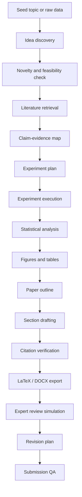

# Workflow Map

Current recommended version: [v0.2.0](workflow-v0.2.md).

## End-To-End Pipeline

## Minimum Viable Research Assistant

For a star-friendly open-source project, start narrow:

1. Input a research topic, seed PDF, or arXiv URL.
2. Retrieve 20 to 50 related papers.
3. Produce a claim-evidence table.
4. Generate an outline with citation anchors.
5. Run a citation verification pass.
6. Export Markdown plus BibTeX.

This is easier to trust than a fully autonomous paper generator and more useful
to real researchers.

## Stronger Version

Add these modules after the MVP:

- Experiment plan generator.
- Result table parser.
- Figure recommendation engine.
- LaTeX template export.
- DOCX export through Pandoc.
- Peer-review scorecard.
- Response-to-reviewer draft generator.
