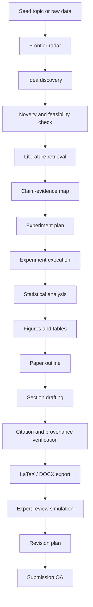

# Workflow Map

Current recommended version: [v3.2.0](workflow-v3.2.md), with installable skills listed in [Skill Roadmap](skill-roadmap.md).

## End-To-End Pipeline

```mermaid
flowchart TD
  A["Seed topic or raw data"] --> B["Frontier radar"]
  B --> C["Idea discovery"]
  C --> D["Novelty and feasibility check"]
  D --> E["Literature retrieval"]
  E --> F["Claim-evidence map"]
  F --> G["Experiment plan"]
  G --> H["Experiment execution"]
  H --> I["Statistical analysis"]
  I --> J["Figures and tables"]
  J --> K["Paper outline"]
  K --> L["Section drafting"]
  L --> M["Citation and provenance verification"]
  M --> N["LaTeX / DOCX export"]
  N --> O["Expert review simulation"]
  O --> P["Revision plan"]
  P --> Q["Submission QA"]
```

## Minimum Viable Research Assistant

For a star-friendly open-source project, start narrow:

1. Input a research topic, seed PDF, or arXiv URL.
2. Scan recent repositories, papers, MCP servers, and venue rules.
3. Retrieve 20 to 50 related papers.
4. Produce a claim-evidence table.
5. Generate an outline with citation anchors.
6. Run citation and provenance verification.
7. Export Markdown plus BibTeX.

This is easier to trust than a fully autonomous paper generator and more useful
to real researchers.

## Stronger Version

Add these modules after the MVP:

- Experiment plan generator.
- Result table parser.
- Figure recommendation engine.
- LaTeX template export.
- DOCX export through Pandoc.
- Peer-review scorecard.
- Response-to-reviewer draft generator.
- Skill safety scanning and provenance metadata.
