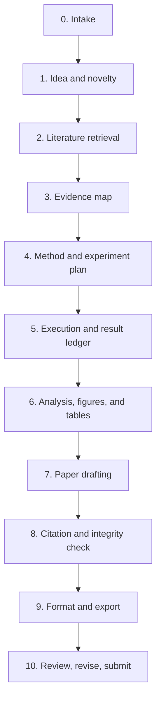

# Paper Research Workflow v0.2.0

Version: `0.2.0`

Date: `2026-05-17`

This is the recommended operating workflow for using the repositories and skills in this catalog. It is designed for AI-assisted paper production where the model does most drafting, retrieval, checking, and formatting work, while the human reviews key decisions.

## Core Principle

Do not run the workflow as one long prompt. Run it as a gated pipeline. Each stage produces an artifact, and the next stage can only continue after the artifact passes a quality gate.

## Pipeline

## Stage Details

| Stage | Output | Gate |
| --- | --- | --- |
| 0. Intake | Topic, audience, venue target, available data, constraints | The task is narrow enough to research and test. |
| 1. Idea and novelty | Research question, hypothesis, novelty notes, risk list | The idea is not just a generic trend summary. |
| 2. Literature retrieval | Search log, paper list, BibTeX, source PDFs or URLs | Important claims have traceable sources. |
| 3. Evidence map | Claim-evidence table with citation anchors | Every planned claim has a source, result, or explicit gap. |
| 4. Method and experiment plan | Method plan, dataset plan, baseline plan, evaluation metrics | The experiment is reproducible before it is executed. |
| 5. Execution and result ledger | Commands, configs, outputs, errors, metrics | Results can be regenerated or audited. |
| 6. Analysis, figures, and tables | Statistical notes, final tables, figure briefs, source data | Figures match the claims and are not decorative. |
| 7. Paper drafting | IMRAD or venue-specific manuscript draft | Sections cite evidence instead of inventing support. |
| 8. Citation and integrity check | Citation report, unsupported-claim list, reference fixes | No hallucinated references or unverified core claims. |
| 9. Format and export | Markdown, BibTeX, LaTeX, DOCX, PDF when possible | Output follows the selected venue/template. |
| 10. Review, revise, submit | Reviewer simulation, revision plan, response letter | Major weaknesses are resolved or explicitly disclosed. |

## Automation Split

Use AI for:

- Idea expansion and comparison.
- Literature search query planning.
- Paper summarization and evidence extraction.
- Drafting, rewriting, bilingual explanation, and review response drafts.
- Figure suggestions and table narratives.
- Reviewer simulation and revision planning.

Use deterministic tools for:

- BibTeX parsing and DOI checks.
- Reference and citation validation.
- LaTeX compilation.
- DOCX/PDF export.
- Test execution, result collection, and table generation.
- Link checks and repository data updates.

Use human approval for:

- Final research question.
- Methodology and ethical constraints.
- Whether a result supports a claim.
- Final submission text.
- Any outreach, publication, or monetization message sent under your name.

## Recommended Repo Modules

| Module | Purpose |
| --- | --- |
| `data/` | Store curated repository metadata, stage definitions, and observed signals. |
| `docs/` | Publish workflow maps, playbooks, stage guides, and review notes. |
| `scripts/` | Keep deterministic renderers and checkers outside the LLM prompt. |
| `templates/` | Future home for paper brief, claim-evidence map, reviewer scorecard, and response letter templates. |
| `.github/workflows/` | Automate list rendering, link checks, and periodic signal refresh. |

## v0.2.0 Upgrade Over v0.1

- Adds explicit versioning.
- Adds a frontier review layer.
- Adds human approval gates instead of pretending full autonomy is always safe.
- Adds evidence and citation gates before paper review.
- Adds an experiment ledger requirement for reproducibility.
- Separates creative AI tasks from deterministic scripts.

## Next Version Targets

For `v0.3.0`, prioritize:

- Add `templates/research-brief.md`.
- Add `templates/claim-evidence-map.md`.
- Add `templates/reviewer-scorecard.md`.
- Add a link checker workflow.
- Add a script that refreshes GitHub stars/forks from the GitHub API.
