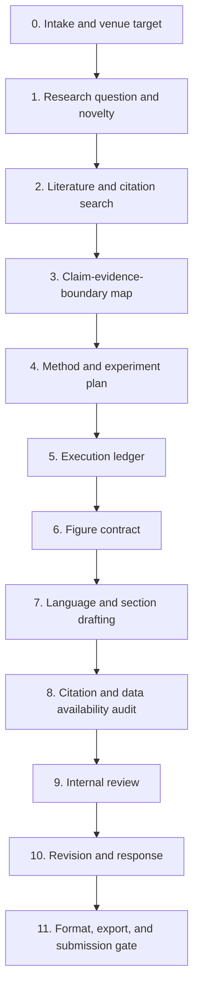

# Paper Research Workflow v3.0.0

Version: `3.0.0`

Date: `2026-05-18`

This release upgrades the repository from a curated map into a stricter paper-skill operating system. It is inspired by mature public skill repositories, especially `nature-skills`, but keeps this project broader than Nature-family writing.

## Design Goal

Build a workflow that can produce useful paper artifacts while reducing five common AI failures:

1. Unsupported scientific claims.
2. Fabricated or weak citations.
3. Beautiful but scientifically redundant figures.
4. Polished English that changes the meaning.
5. Reviewer responses that promise changes not present in the manuscript.

## v3.0 Pipeline



## Stage Gates

| Stage | Main Artifact | Gate |
| --- | --- | --- |
| 0. Intake and venue target | Paper brief | Venue, audience, language, data, and ethical constraints are explicit. |
| 1. Research question and novelty | RQ brief | The idea has a narrow bottleneck and a falsifiable contribution. |
| 2. Literature and citation search | Search log and BibTeX | Search concepts, IDs, and sources are recorded. |
| 3. Claim-evidence-boundary map | Claim table | Each claim has evidence, support grade, and boundary. |
| 4. Method and experiment plan | Reproducibility plan | Baselines, metrics, datasets, and failure cases are defined. |
| 5. Execution ledger | Result ledger | Commands, configs, outputs, metrics, and errors are auditable. |
| 6. Figure contract | Figure plan | Every panel has a unique scientific question and source data. |
| 7. Language and section drafting | Manuscript sections | Section movement, tense, hedging, and evidence anchors pass review. |
| 8. Citation and data availability audit | Integrity report | No hallucinated references; datasets have access routes. |
| 9. Internal review | Review scorecard | Major rejection risks are listed with fix plans. |
| 10. Revision and response | Response map | Each comment has an ID, action, evidence, and location. |
| 11. Format, export, and submission gate | Final package | Markdown, BibTeX, LaTeX/DOCX/PDF, figures, and supplementary files align. |

## Language System

### Manuscript Argument Chain

Every paper should pass this chain before writing:

```text
field-scale need -> unresolved bottleneck -> proposed move -> decisive evidence -> broader implication -> boundary
```

If a link is missing, mark it as missing. Do not write around the gap.

### Section Moves

| Section | Required Movement |
| --- | --- |
| Abstract | Context -> gap -> approach -> key result -> implication -> boundary |
| Introduction | Field stake -> bottleneck -> prior attempts -> remaining gap -> present study |
| Results | Question -> action -> quantitative result -> evidence -> short interpretation |
| Methods | Motivation -> design -> procedure -> reproducibility detail |
| Discussion | Advance -> evidence meaning -> prior work relation -> limits -> future use |
| Conclusion | Main contribution -> decisive evidence -> implication -> boundary |

### Language Gate

Before final output:

- Split overloaded sentences.
- Keep each sentence to one main proposition.
- Prefer precise cautious prose over conversational confidence.
- Match tense to section.
- Define abbreviations on first use.
- Use British spelling for Nature-style outputs.
- Keep numbers and units exact.
- Do not alter quantitative values unless the author requests a correction.
- Replace overclaim words with bounded alternatives.
- Translate Chinese intent and scientific logic, not clause order.

### Overclaim Ladder

| Stronger | Safer When Evidence Is Limited |
| --- | --- |
| prove | show / suggest |
| conclusively demonstrate | provide evidence that |
| first | to our knowledge |
| superior | improved in this setting |
| universal | in this cohort / dataset / condition |
| causes | is associated with / may contribute to |

## Figure System

### Mandatory Figure Contract

Use [templates/figure-contract.md](../templates/figure-contract.md) before generating or revising a major figure.

Each figure must define:

- One central scientific claim.
- Panel-level question and evidence source.
- Chart family.
- Source data path.
- Sample size and statistics.
- Palette semantics.
- Export formats.
- Redundancy risk.
- Caption claim.

### Figure Style Gate

For Python/matplotlib figures:

- Set sans-serif font family before plotting.
- Keep SVG text editable.
- Save SVG as the primary output.
- Save PNG at 300 dpi as preview.
- Remove top and right spines unless a special chart needs them.
- Use frameless or shared legends.
- Avoid grid lines by default.
- Keep palette semantics stable across panels.
- Do not reuse one dataset in several panels unless each panel answers a different question.

### Panel Information Architecture

Prefer:

```text
overview -> deviation -> relationship
```

Example:

| Panel | Role |
| --- | --- |
| a | Overview: composition, workflow, design space, or cohort landscape |
| b | Deviation: what is enriched, depleted, changed, or atypical |
| c | Relationship: correlation, mechanism, interaction, or trade-off |
| d | Validation: baseline comparison, ablation, stress test, or external cohort |

## Citation System

Use [templates/claim-evidence-boundary.md](../templates/claim-evidence-boundary.md) for each important manuscript claim.

### Claim Segmentation

Break claims into:

- Phenomenon.
- Entity.
- Relationship.
- Context.
- Boundary.

### Support Grades

| Grade | Meaning |
| --- | --- |
| Strong | Directly tests the same relationship in a comparable context. |
| Partial | Supports one component or a narrower setting. |
| Background | Establishes field context but not the main claim. |
| Limiting | Contradicts or narrows the claim. |
| Metadata-only | Candidate found but abstract/full text not checked. |

## Data Availability System

Each result-supporting dataset must map to:

- Result or figure supported.
- Public repository or restricted access route.
- Identifier, DOI, accession, or planned persistent ID.
- Licence or reuse condition.
- README/data dictionary status.
- Restriction reason and access controller if non-public.
- Dataset citation wording.

## Review And Revision System

Use [templates/reviewer-response-map.md](../templates/reviewer-response-map.md) for revision work.

Every reviewer comment must have:

- Stable ID.
- Comment type.
- Risk level.
- Action code.
- Response draft.
- Manuscript location.
- Evidence or analysis added.
- Unresolved author input if needed.

## Planned Skill Folders

```text
skills/
  INDEX.md
  paper-language-polishing/
  paper-figure-contract/
  paper-citation-audit/
  paper-data-availability/
  paper-review-response/
  paper-submission-gate/
```

Each folder currently contains:

```text
SKILL.md
references/
```

See [Skill Roadmap](skill-roadmap.md) and [Skill Index](../skills/INDEX.md).

## v3.0 Acceptance Checklist

- [x] README points to the current workflow version.
- [x] A deep-dive reference note explains the source inspiration.
- [x] Claim, figure, and reviewer-response templates exist.
- [x] Citation and data gates are explicit.
- [x] Core skill folders exist with `SKILL.md` and focused references.
- [x] The workflow warns against fabricated claims, citations, data, and reviewer promises.
