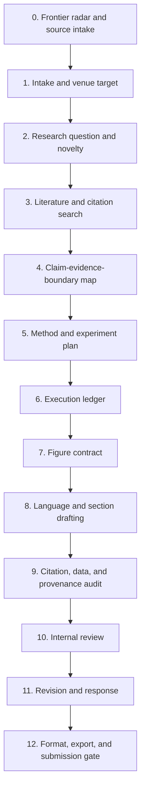

# Paper Research Workflow v3.2.0

Version: `3.2.0`

Date: `2026-06-04`

This version keeps the strict v3.0 Nature-inspired gates, then adds a current
frontier layer: Agent Skills compatibility, `gh skill` installability, skill
provenance, safety scanning, Zotero/MCP-aware literature access, and durable
research-state capture.

## v3.2 Pipeline



## What v3.2 Adds

| Layer | New Requirement | Why |
| --- | --- | --- |
| Frontier radar | Track recent papers, repos, tools, venue rules, and skill ecosystem changes before drafting. | Prevent stale workflows and turn online updates into evidence-backed backlog items. |
| Skill provenance | Record source repo, observed date, install path, license, and safety notes for any adopted skill. | Makes the project compatible with the current Agent Skills ecosystem and safer for contributors. |
| Literature memory | Prefer Zotero/local-library/MCP sources when the user has a library; use web search as a complement. | Reduces duplicate searches and makes citation checks more grounded. |
| State ledger | Keep durable logs for searches, claims, experiments, figures, drafts, review comments, and final packaging. | Long-running research fails when state is scattered across chats and terminals. |
| Security posture | Inspect third-party skills before recommending installation; flag prompt-injection and data-exfiltration risks. | Skills can influence agent behavior and run code, so paper workflows need explicit trust boundaries. |

## Stage Gates

| Stage | Main Artifact | Gate |
| --- | --- | --- |
| 0. Frontier radar and source intake | Frontier ledger | Recent sources are recorded with URL, date, claim, relevance, risk, and action. |
| 1. Intake and venue target | Paper brief | Venue, audience, language, data, ethics, and AI-use constraints are explicit. |
| 2. Research question and novelty | RQ brief | The idea has a narrow bottleneck, falsifiable contribution, and freshness check. |
| 3. Literature and citation search | Search log and BibTeX | Search concepts, IDs, databases, local-library hits, and sources are recorded. |
| 4. Claim-evidence-boundary map | Claim table | Each claim has evidence, support grade, boundary, and citation status. |
| 5. Method and experiment plan | Reproducibility plan | Baselines, metrics, datasets, failure cases, compute, and licenses are defined. |
| 6. Execution ledger | Result ledger | Commands, configs, outputs, metrics, errors, and failed routes are auditable. |
| 7. Figure contract | Figure plan | Every panel has a unique scientific question, source data, and export plan. |
| 8. Language and section drafting | Manuscript sections | Section movement, tense, hedging, and evidence anchors pass review. |
| 9. Citation, data, and provenance audit | Integrity report | No fabricated references; datasets and adopted skills have provenance. |
| 10. Internal review | Review scorecard | Major rejection risks are listed with fix plans and owner input needed. |
| 11. Revision and response | Response map | Each comment has an ID, action, evidence, and manuscript location. |
| 12. Format, export, and submission gate | Final package | Markdown, BibTeX, LaTeX/DOCX/PDF, figures, supplements, and AI-use notes align. |

## Skill Order

```text
paper-frontier-radar
-> paper-citation-audit
-> paper-figure-contract
-> paper-language-polishing
-> paper-data-availability
-> paper-review-response
-> paper-submission-gate
```

## Frontier Ledger Fields

Use these fields when scanning public updates:

| Field | Meaning |
| --- | --- |
| `source` | URL or local library identifier. |
| `observed_date` | Date the source was checked. |
| `type` | repo, paper, venue-rule, MCP, skill, dataset, benchmark, or security note. |
| `claim` | The specific update or pattern observed. |
| `evidence` | Direct evidence from README, docs, release notes, paper abstract, or code. |
| `workflow_impact` | Which paper stage should change. |
| `trust_status` | verified, metadata-only, stale, conflicting, or needs human review. |
| `next_action` | adopt, watch, cite, ignore, test locally, or open issue. |

## Acceptance Checklist

- [x] README points to `workflow-v3.2.md`.
- [x] A current frontier update note exists.
- [x] `paper-frontier-radar` exists as an installable skill folder.
- [x] Skill index starts with the frontier-radar stage.
- [x] Workflow map reflects provenance, local-library, and safety-scanning gates.
- [x] The workflow separates verified evidence from metadata-only discovery.
